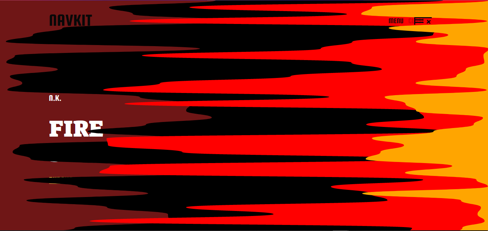

# Navkit overlay menu

This is a solution to improve the users experience when they visit your website.

## Table of contents

- [Overview](#overview)
  - [The functionalities](#the-functionalities)
  - [Screenshot](#screenshot)
  - [Links](#links)
- [My process](#my-process)
  - [Built with](#built-with)
  - [Useful resources](#useful-resources)
- [Author](#author)

## Overview

### The functionalities

Availible functionalities:

- Animated background with SVG.
- Animated toggle label.
- Animated toggle button.
- Animated menu items

### Screenshot

### Links

- Solution URL: [Git repository](https://github.com/VereAbsolutum/navbar)
- Live Site URL: [Live preview](https://vereabsolutum.github.io/navbar/)

## My process

### Built with

- Semantic HTML5 markup
- CSS custom properties
- Flexbox
- CSS Grid
- Mobile-first workflow
- animeJS
- navkit

### Useful resources

- [animeJS](https://animejs.com/) - This helped me to create the animation for the background and the others components
- [GoogleFonts](https://fonts.google.com/) - This helped me to style the font-family for the navkit overlay menu project
- [FontAwesome](https://fontawesome.com/) - This helped me with the icons used in this project

## Author

- Website - [VereAbsolutum portifolio](https://codecanyon.net/user/vereabsolutum/portfolio)
